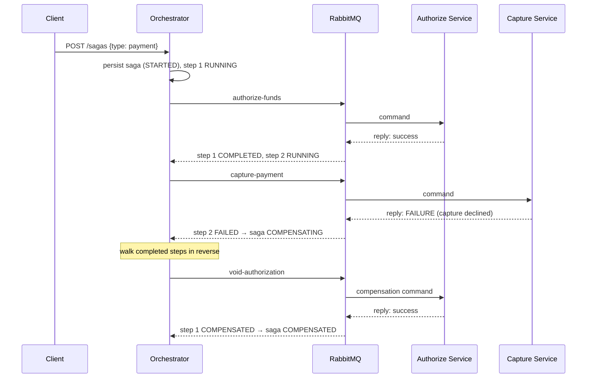
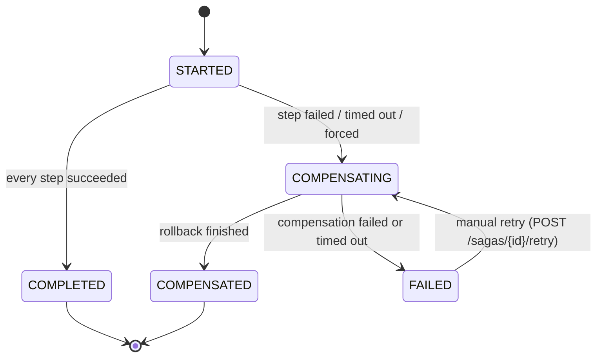

# spring-saga-orchestrator


[](https://github.com/William-Nogueira/spring-saga-orchestrator/actions/workflows/ci.yml)

An **orchestration-based Saga coordinator** for distributed payment transactions, built with
Spring Boot 4 and Java 25. A central engine drives multi-step transactions over RabbitMQ,
persists every state change, **compensates completed steps in reverse on failure**, retries
silent steps with backoff, recovers in-flight sagas after a crash, and exposes manual
intervention endpoints for the cases automation shouldn't decide.

> 📝 I wrote about the design decisions behind this project, including why it has no
> transactional outbox [on dev.to](https://dev.to/williamnogueira/distributed-transactions-in-java-why-i-skipped-the-outbox-pattern-1n52).



Every state change is persisted **before** any message leaves the service, every reply is
matched against the step's state machine, and anything that stays silent past its deadline is
retried, then rolled back.

The engine is **domain-agnostic**: it walks whatever steps a **SagaFactory** defines. Adding a new
saga type is one factory class: the API, engine, and topology don't change.

## Running it

```bash
docker compose up --build
```

Boots the orchestrator, Postgres, and RabbitMQ. Then:

- Swagger UI: http://localhost:8080/swagger-ui.html
- Prometheus metrics: http://localhost:8080/actuator/prometheus
- RabbitMQ console: http://localhost:15672 (user & pass: saga)

Start a saga:

```bash
curl -X POST http://localhost:8080/sagas \
  -H "Content-Type: application/json" \
  -d '{"type": "payment", "payload": {"orderId": "42", "amount": 99.90, "currency": "BRL"}}'
```

> **Note:** the participant services are deliberately not part of this deployable, so no reply
> ever arrives. After the timeout budget the orchestrator rolls the saga back on its own and
> `GET /sagas/{id}` shows it `COMPENSATED`. That is the demo: an orchestrator handling dead
> participants. The full happy path runs in the e2e tests (`./mvnw verify`), where simulated
> participants consume the real queues.

### Saga state machine



`FAILED` means exactly one thing: *the rollback itself broke and a human should look*. Business
failures never end in `FAILED`: they end in `COMPENSATED`, because the system cleaned up after
itself.

## Failure handling

| Scenario | Behavior |
|---|---|
| Participant replies with a business failure | No retry: step `FAILED`, completed steps compensated in reverse, saga `COMPENSATED` |
| Participant stays silent | Retry with linear backoff up to `saga.step-max-attempts`, then compensate |
| Compensation fails or times out | Step `COMPENSATION_FAILED`, saga `FAILED`: manual intervention |
| Duplicate or late reply | Ignored: a reply only acts on a step in `RUNNING`/`COMPENSATING` state |
| Orchestrator crashes mid-saga | Recovery sweeper re-drives stuck steps from persisted state on startup and on schedule |
| Operator intervention | `POST /sagas/{id}/retry` resumes a failed rollback; `POST /sagas/{id}/compensate` force-rolls-back an in-flight saga |

## API

| Method | Path | Purpose |
|---|---|---|
| `POST` | `/sagas` | Start a saga: `{"type": "payment", "payload": {...}}` → `202` |
| `GET` | `/sagas/{id}` | Saga with live per-step status |
| `POST` | `/sagas/{id}/retry` | Resume the rollback of a `FAILED` saga (`409` otherwise) |
| `POST` | `/sagas/{id}/compensate` | Force-roll-back a `STARTED` saga (`409` otherwise) |

Unknown saga types and invalid payloads return RFC 9457 problem details; each factory validates
its own payload.

## Observability

- **Metrics** (`/actuator/prometheus`): `saga_started_total`, `saga_ended_total` and
  `saga_duration_seconds`, tagged by saga type and outcome.
- **Correlated logs**: every async entry point (reply listener, timers, sweeper) puts the
  `sagaId` in the MDC: one grep follows a saga across HTTP, AMQP, and scheduler threads.

## License

This project is licensed under the MIT License - see the [LICENSE](LICENSE) file for details.